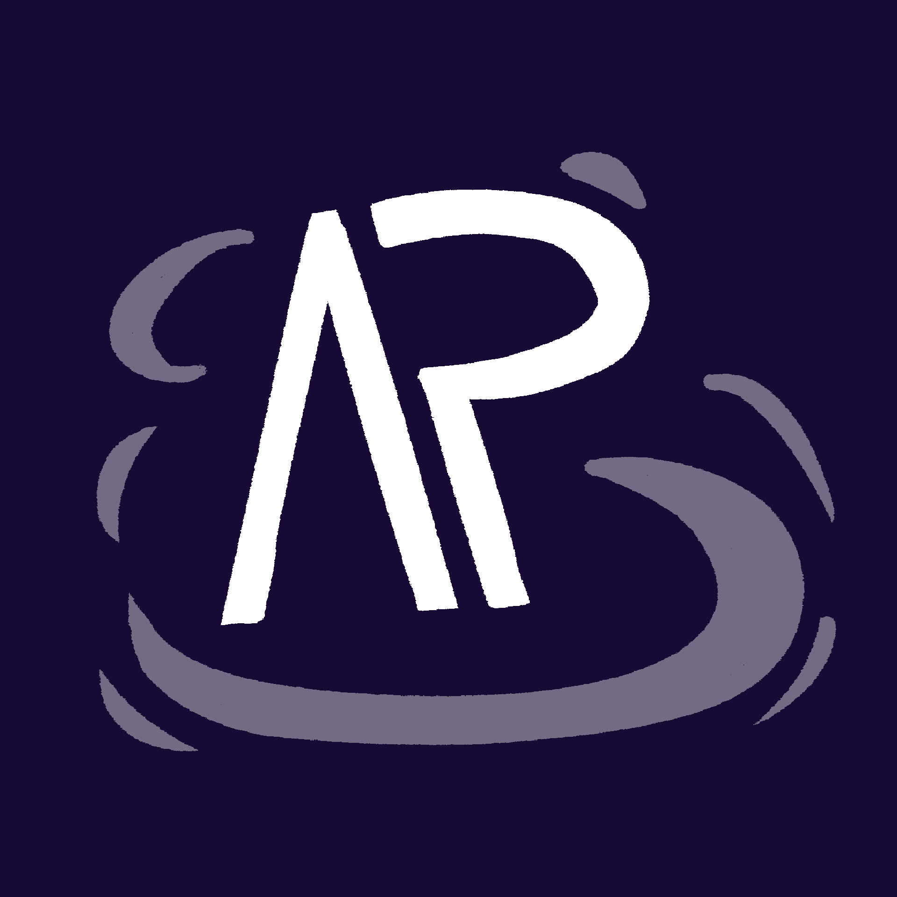

<!--
    SPDX-License-Identifier: CC-BY-SA-4.0

    SPDX-FileCopyrightText: Space Kobold Games and Contributors <https://github.com/space-kobold/alpha-paradox>
-->

<h1 align="center">Alpha Paradox</h1>

A Space Station 14 experience crafted for deep immersion and deliberate storytelling

    <a href="https://alpha-paradox.com">Website</a>
    &middot;
    <a href="https://discord.alpha-paradox.com">Discord</a>
    &middot;
    <a href="https://devwiki.alpha-paradox.com">Dev Wiki</a>
    &middot;
    <a href="https://wiki.alpha-paradox.com">Player Wiki</a>

---

## About Alpha Paradox

AlphaParadox is a fork of [space-wizards/space-station-14](https://github.com/space-wizards/space-station-14) ("Space Station 14"), focused on creating a more immersive experience through longer rounds and a focused design direction.

Space Station 14 itself is a C# remake of Space Station 13, which uses the custom [space-wizards/RobustToolbox](https://github.com/space-wizards/RobustToolbox) ("RobustToolbox" or "RT") game engine.

## Contributing

Alpha Paradox welcomes community contributions.

Check out [CONTRIBUTING.md](./CONTRIBUTING.md) for information on how to contribute.

## Forking

Alpha Paradox is open to forks, but remember to comply with all licenses as stated within the files.

**Do not, under any circumstances, remove any file-based or other attributions.**

Alpha Paradox has many `MPL-2.0` ("MPLv2") and `MPL-2.0-no-copyleft-exception` ("MPLv2 Exhibit B") files, which requires
release of modified files. `MPL-2.0-no-copyleft-exception` additionally does not allow you to relicense/incorporate it
inside of a LGPL/GPL/AGPL codebase.

There are also many `CC-BY-SA-NC-4.0` files, which may need to be removed for commercial forks.

Finally, we would suggest disabling things such as:
- The CLA GitHub action found in `.github/workflows/cla.yml`.

## Licensing/Attribution

Alpha Paradox is a relatively unique example of a multi-licensed project. Much of that is inherited from Space Station 13/14's storied history.

For the most important points, please read [LEGAL.md](./LEGAL.md).

In short, we use [REUSE tool](https://reuse.software/) to ensure files are all licensed and provided with copyright
information.

All files either have a header providing the license and copyright information, or have a `REUSE.toml` in same directory
listing its copyright.

License text can be found in the [Licenses directory](./LICENSES).

We have a [Contributor License Agreement](./LEGAL.md) that will need to be signed before any contributions.

**Finally, always ensure you are in compliance with the license.**
